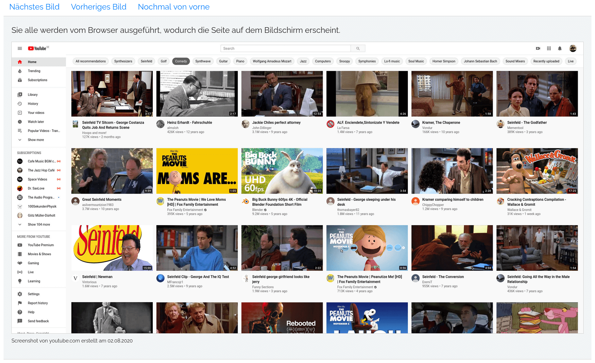
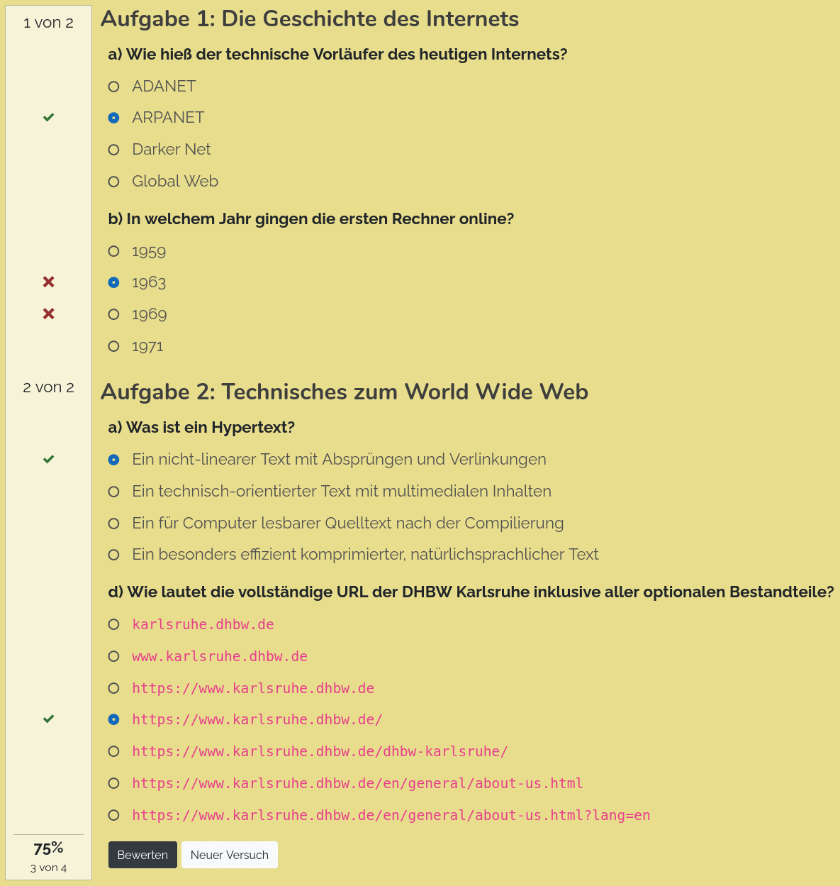
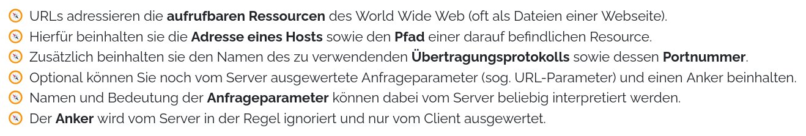

lecture-slides.js: Additional HTML Tags
=======================================

Description
-----------

This plugin simplifies content creation with `lecture-slides.js` and
`mini-tutorial.js` by defining additional HTML tags for complex elements:

 * Bootstrap grids
 * Info boxes (information, warning, critical)
 * Tab pages to switch between multiple sub-pages
 * Accordion to switch between multiple sub-pages
 * Carousels to manually slide through a linear process
 * Embedded Youtube videos
 * Interactive quizes
 * Lists with emoji symbols
 * Edit and Download GitHub Repositories online

Please note, that this requires the Bootstrap framework in your document.
For `lecture-slides.js` this is no problem, as Bootstrap is already used
for the main UI and can be used, anyway. For `mini-tutorial.js` projects
Bootstrap must be manually added to the project as it is intentionaly not
defined as a dependency here.

Installation
------------

**If you are using `mini-tutorial.js`:**

 1. Add Bootstrap to you project, if you are using `mini-tutorial.js`.
 1. Make sure your bundler allows loading of LESS stylesheets

**In all cases:**

 1. Add this plugin to your presentation: `$ npm add --save-dev @dschulmeis/ls-plugin-extra-tags`
 1. Import it in the `index.js` file
 1. Use the HTML tags below in your presentation

Example for `lecture-slides.js`:

```javascript
"use strict";

import SlideshowPlayer from "lecture-slides.js";
import LS_Plugin_ExtraTags from "ls-plugin-extra-tags";

window.addEventListener("load", () => {
    let player = new SlideshowPlayer({
        plugins: {
            ExtraTags: new LS_Plugin_ExtraTags({
                // Carousel control labels
                labelCarouselNext: "Next Step",
                labelCarouselPrev: "Previous Step",
                labelCarouselReset: "Restart",

                labelGithubEditOnline: "Start Online-IDE",
                labelGithubEditDownload: "Download Source Code",

                labelQuizPoints: "{1} from {2}",
                labelQuizEvaluate: "Correct",
                labelQuizNewTry: "New Try",
                quizExerciseHeading: "h2",

                githubEditUrlPrefix: "https://github.com/DennisSchulmeister/dhbwka-wwi-webprog-quellcodes/tree/master/",
            }),
        }
    });

    player.start();
});
```

Example for `mini-tutorial.js`:

```javascript
import MiniTutorial from "@dschulmeis/mini-tutorial.js";
import LS_Plugin_ExtraTags from "ls-plugin-extra-tags";

import "bootstrap/dist/css/bootstrap.min.css";
import "bootstrap/dist/js/bootstrap.bundle.min.js";

window.addEventListener("load", () => {
    let mt = new MiniTutorial({
        plugins: [
            new LS_Plugin_ExtraTags({
                // Same options as above
            }),
        ]
    });

    mt.start();
});
```

Usage
-----

**Grids**

This is just a simple wrapper around bootstrap's `<div class="container-fluid">`,
`<div class="row">` and `<div class="col">` to make the HTML code more readable.

```html
<lsx-grid-fluid>
    <lsx-row>
        <lsx-col size="md-6 xl-8">
            ...
        </lsx-col>
    </lsx-row>
</lsx-grid-fluid>
```

This will be translated to:

```html
<div class="container-fluid">
    <div class="row">
        <div class="col-md-6 col-xl-8">
            ...
        </div>
    </div>
</div>
```

`<lsx-grid>` will be translated to `<div class="container">`.

**Info boxes**

Information boxes highlight important information, like this:


```html
<lsx-info-box>
    Some additional information …
</lsx-info-box>

<lsx-info-box type="warning">
    Beware of the dog! He is selling pocket bibles.
</lsx-info-box>

<lsx-info-box type="critical" title="Important Notice">
    This is a critical information with a title.
</lsx-info-box>
```

They will be rendered as:

```html
<div class="info-box critical">
    <div class="info-box-title">
        Important Notice
    </div>
    <div class="info-box-content">
        This is a critical information with a title.
    </div>
</div>
```

**Tab pages**

Tab pages allow to switch between different content pages by clicking
on a title.


```html
<lsx-tab-pages id="example">
    <lsx-tab-page title="Explanation">
        Content of the first tab page.
    </lsx-tab-page>
    <lsx-tab-page title="Case Study">
        Content of the second tab page.
    </lsx-tab-page>
    <lsx-tab-page title="Example Code">
        Content of the third tab page.
    </lsx-tab-page>
</lsx-tab-pages>
```

They will be rendered as plain bootstrap tab pages:

```html
<div>
    <ul class="nav nav-tabs" role="tablist">
        <li class="nav-item">
            <a
                id             = "example-page1-tab"
                class          = "nav-link active"
                data-bs-toggle = "tab"
                href           = "#example-page1"
                role           = "tab"
                aria-controls  = "example-page1"
                aria-expanded  = "true"
            >
                Explanation
            </a>
        </li>
        <li class="nav-item">
            <a
                id             = "example-page2-tab"
                class          = "nav-link"
                data-bs-toggle = "tab"
                href           = "#example-page2"
                role           = "tab"
                aria-controls  = "example-page2"
            >
                Case Study
            </a>
        </li>
    </ul>
    <div class="tab-content">
        <div
            class           = "tab-pane fade show active"
            id              = "example-page1"
            role            = "tabpanel"
            aria-labelledby = "example-page1-tab"
        >
            Content of the first tab page.
        </div>
        <div
            class           = "tab-pane fade"
            id              = "example-page2"
            role            = "tabpanel"
            aria-labelledby = "example-page2-tab"
        >
            Content of the second tab page.
        </div>
    </div>
</div>
```

**Accordion**

An accordion works similar to tab pages in that it allows to switch between
multiple sub-pages. Unlike tab pages, the accordion pages are stacked
verticaly, however.


```html
<lsx-accordion id="example">
    <!-- Short version with plain-text title -->
    <lsx-accordion-page title="First Page" bold active>
        Content of the first accordion page.
    </lsx-accordion-page>

    <!-- Long version with HTML title -->
    <lsx-accordion-page>
        <lsx-accordion-title>
            <b>Second Page</b>
        </lsx-accordion-title>
        <lsx-accordion-content>
            Content of the second accordion page.
        <lsx-accordion-content>
    </lsx-accordion-page>
</lsx-accordion>
```

This will be rendered as:

```html
<div id="example" class="accordion">
    <div class="accordion-item">
        <div
            id    =  "example-page1-title"
            class = "accordion-header font-weight-bold"
        >
            <button
                class          = "accordion-button bg-light text-body fs-5"
                type           = "button"
                data-bs-toggle = "collapse"
                data-bs-target = "#example-page1-content"
                aria-controls  = "example-page1-content"
                aria-expanded  = "false"
            >
                First Page
            </button>
        </div>
        <div
            id              = "example-page1-content"
            class           = "accordion-collapse collapse"
            aria-labelledby = "example-page1-title"
            data-bs-parent  = "#example"
        >
            <div class="accordion-body">
                Content of the first accordion page.
            </div>
        </div>
    </div>

    <div class="accordion-item">
        <div
            id    = "example-page2-title"
            class = "accordion-header"
        >
            <button
                class          = "accordion-button bg-light text-body fs-5"
                type           = "button"
                data-bs-toggle = "collapse"
                data-bs-target = "#example-page2-content"
                aria-controls  = "example-page2-content"
                aria-expanded  = "false"
            >
                <b>Second Page</b>
            </button>
        </div>
        <div
            id              = "example-page2-content"
            class           = "accordion-collapse collapse"
            aria-labelledby = "example-page2-title"
            data-bs-parent  = "#example"
        >
            <div class="accordion-body">
                Content of the second accordion page.
            </div>
        </div>
    </div>
</div>
```

The attribute `active` can be used to open one page by default. Accordingly
the attribute `bold` can be used to render a bold page title.

**Slide Carousel**

A carousel allows to manually slide through a linear sequence of images.
Unlike typical HTML carousels, this one doesn't automaticaly move but
rather requires to click a link to see the next card.



Basic example:

```html
<lsx-carousel id="example">
    <lsx-carousel-page>
        Content of the first step.
    </lsx-carousel-page>
    <lsx-carousel-page>
        Content of the second step.
    </lsx-carousel-page>
    <lsx-carousel-page>
        Content of the third step.
    </lsx-carousel-page>
</lsx-carousel>
```

If wanted, additional links can be created to directly jump to a given page:

```html
<lsx-carousel id="example">
    <lsx-carousel-page>
        Content of the first step.
    </lsx-carousel-page>
    <lsx-carousel-page direct-link="Second Page">
        Content of the second step.
    </lsx-carousel-page>
    <lsx-carousel-page direct-link="Closing Notes">
        Content of the third step.
    </lsx-carousel-page>
</lsx-carousel>
```

Carousels will be rendered to plain bootstrap carousels:

```html
<div class="carousel-outer">
    <ul class="nav nav-tabs" role="tablist">
        <li class="nav-item">
            <a href="#example-carousel" class="nav-link" data-bs-slide="next">Next Step</a>
        </li>
        <li class="nav-item">
            <a href="#example-carousel" class="nav-link" data-bs-slide="prev">Previous Step</a>
        </li>
        <li class="nav-item">
            <a href="#example-carousel" class="nav-link" data-bs-slide-to="0">Restart</a>
        </li>
    </ul>
    <ul class="nav nav-tabs" role="tablist">
        <li class="nav-item">
            <small>
                <a href="#example-carousel" class="nav-link" data-bs-slide-to="1">Second Page</a>
            </small>
        </li>
        <li class="nav-item">
            <small>
                <a href="#example-carousel" class="nav-link" data-bs-slide-to="2">Closing Notes</a>
            <small>
        </li>
    </ul>
    <div id="example-carousel" class="carousel slide mb-0" data-bs-interval="false">
        <div class="carousel-inner">
            <div class="carousel-item active">
                Content of the first step.
            </div>
            <div class="carousel-item">
                Content of the second step.
            </div>
            <div class="carousel-item">
                Content of the third step.
            </div>
        </div>
    </div>
</div>
```

**Youtube Videos**

This element allows to embedded any youtube video, whose video ID (found in
the youtube URL) is known.


```html
<lsx-youtube video="HERMqverQWM" aspect-ratio="16by9"></lsx-youtube>
```

The video will be embedded with no cookies to protect the viewers identity.
It will be rendered as:

```html
<div class="embed-responsive ratio ratio-16x9">
    <iframe src="https://www.youtube-nocookie.com/embed/HERMqverQWM?rel=0&amp;showinfo=0" allowfullscreen></iframe>
</div>
```

The aspect ratio can be any ration supported by bootstrap:

 * `21x9`
 * `16x9` (default)
 * `4x3`
 * `1x1`

**Interactive Quizes**

Currently this element allows to define interactive quizes with multiple-choice
and single-choice questions. In future, different answer types could be added
depending on actual need.



A minimal, working example could be this:

```html
<lsx-quiz prefix="Quiz #:">
    <lsx-exercise title="History of the Internet">
        <lsx-question
            type = "single-choice"
            text = "a) What was the name of the Internet's precursor?"
        >
            <lsx-answer>ADANET</lsx-answer>
            <lsx-answer correct>ARPANET</lsx-answer>
            <lsx-answer>Darker Net</lsx-answer>
            <lsx-answer>Global Web</lsx-answer>
        </lsx-question>

        <lsx-question
            type = "single-choice"
            text = "b) In which year the first computer went online?"
        >
            <lsx-answer>1959</lsx-answer>
            <lsx-answer>1963</lsx-answer>
            <lsx-answer correct>1969</lsx-answer>
            <lsx-answer>1971</lsx-answer>
        </lsx-question>
    </lsx-exercise>

    <lsx-exercise title="Technical Details on the Internet">
        <lsx-question
            type = "single-choice"
            text = "a) What is a Hypertext? "
        >
            <lsx-answer correct>A non-linear text with navigations and links</lsx-answer>
            <lsx-answer>A technical-oriented text with multimedia content</lsx-answer>
            <lsx-answer>A computer readable source code after compilation</lsx-answer>
            <lsx-answer>A particularly efficiently compressed, natural language text</lsx-answer>
        </lsx-question>

        <lsx-question
            type = "single-choice"
            text = "b) What is the complete URL of DHBW Karlsruhe including all optional components?"
        >
            <lsx-answer><code>karlsruhe.dhbw.de</code></lsx-answer>
            <lsx-answer><code>www.karlsruhe.dhbw.de</code></lsx-answer>
            <lsx-answer><code>https://www.karlsruhe.dhbw.de</code></lsx-answer>
            <lsx-answer correct><code>https://www.karlsruhe.dhbw.de/</code></lsx-answer>
            <lsx-answer><code>https://www.karlsruhe.dhbw.de/dhbw-karlsruhe/</code></lsx-answer>
            <lsx-answer><code>https://www.karlsruhe.dhbw.de/en/general/about-us.html</code></lsx-answer>
            <lsx-answer><code>https://www.karlsruhe.dhbw.de/en/general/about-us.html?lang=en</code></lsx-answer>
        </lsx-question>
    </lsx-exercise>
</lsx-quiz>
```

The nested structure where a `<lsx-quiz>` contains many `<lsx-exercise>`, which
contain many `<lsx-question>`, which contain many `<lsx-answer>` is important
for this feature to work.

Question texts can also be HTML formatter:

```html
<lsx-question type="single-choice">
    <lsx-question-text>
        <b>HTML-formatted</b> question text.
    </lsx-question-text>

    <lsx-answer>Answer 1</lsx-answer>
    <lsx-answer>Answer 2</lsx-answer>
    …
</lsx-question>
```

Answers can be marked correct, wrong and partialy correct:

```html
<lsx-answer correct>
    Correct answer, gives 1 point if ticked.
</lsx-answer>

<lsx-answer partialy-correct>
    Partialy correct answer, gives 0.5 points if ticked.
</lsx-answer>

<lsx-answer wrong>
    Wrong answer, gives -1 point if ticked.
</lsx-answer>
```

**Lists with emoji symbols**

Plain unordered lists sometimes look a bit boring. The custom element
`<lsx-ul>` thus allows to create lists with an emoji as a list symbol:



```html
<lsx-ul emoji="⚽">
    <li>List Item 1</li>
    <li>List Item 2</li>
    <li>List Item 3</li>
</lsx-ul>
```

Normaly this will still be rendered as an html list:

```html
<ul style="list-style-type: '⚽  '";>
    <li>List Item 1</li>
    <li>List Item 2</li>
    <li>List Item 3</li>
</ul>
```

If however at least one of the list items contains its own emoji:

```html
<lsx-ul emoji="⚽">
    <li emoji="🎳">List Item 1</li>
    <li>List Item 2</li>
    <li>List Item 3</li>
</lsx-ul>
```

The list will be rendered as a table, instead:

```html
<table>
    <tr>
        <td style="padding-right: 0.5em;">🎳</td>
        <td>List Item 1</td>
    </tr>
    <tr>
        <td style="padding-right: 0.5em;">⚽</td>
        <td>List Item 2</td>
    </tr>
    <tr>
        <td style="padding-right: 0.5em;">⚽</td>
        <td>List Item 3</td>
    </tr>
</table>
```


**Edit and Download GitHub Repositories online**

For programming assignments you usualy need to provide the source code and
required tools out of band. But if the code is publicly available on GitHub,
you can use this element to provide a link to start an online IDE or directly
download the source code from GitHub:


```html
<lsx-github-edit
    url="https://github.com/DennisSchulmeister/dhbwka-wwi-webprog-quellcodes/tree/master/1%20HTML%20und%20CSS/Aufgaben/Einfaches%20Layout/Aufgabe"
></lsx-github-edit>
```

Optionaly an different url can be given for the download button, e.g. to also
include a sample solution:

```html
<lsx-github-edit
    url      = "https://github.com/DennisSchulmeister/dhbwka-wwi-webprog-quellcodes/tree/master/1%20HTML%20und%20CSS/Aufgaben/Einfaches%20Layout/Aufgabe"
    download = "https://github.com/DennisSchulmeister/dhbwka-wwi-webprog-quellcodes/tree/master/1%20HTML%20und%20CSS/Aufgaben/Einfaches%20Layout"
></lsx-github-edit>
```

Long prefixes, that will remain the same throughout a presentation, can be also be
moved to the plugin configuration (see top of this page).


Copyright
---------

lecture-slides.js: https://www.github.com/DennisSchulmeister/lecture-slides.js <br/>
This plugin: https://github.com/DennisSchulmeister/ls-plugin-extra-tags <br/>
© 2020 – 2022 Dennis Schulmeister-Zimolong <dennis@pingu-mail.de> <br/>
Licensed under the 2-Clause BSD License.
