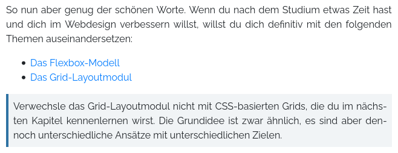

Info Box
========

Information boxes highlight important information, like this:



```html
<lsx-info-box>
    Some additional information …
</lsx-info-box>

<lsx-info-box type="warning">
    Beware of the dog! He is selling pocket bibles.
</lsx-info-box>

<lsx-info-box type="critical" title="Important Notice">
    This is a critical information with a title.
</lsx-info-box>
```

They will be rendered as:

```html
<div class="info-box critical">
    <div class="info-box-title">
        Important Notice
    </div>
    <div class="info-box-content">
        This is a critical information with a title.
    </div>
</div>
```