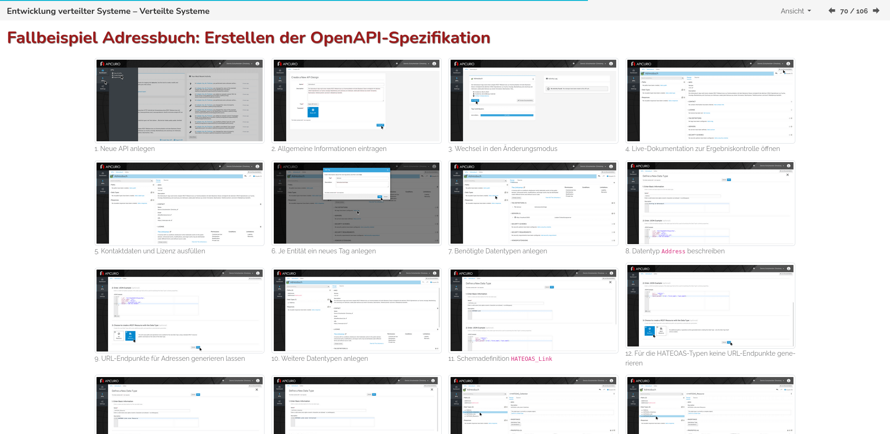
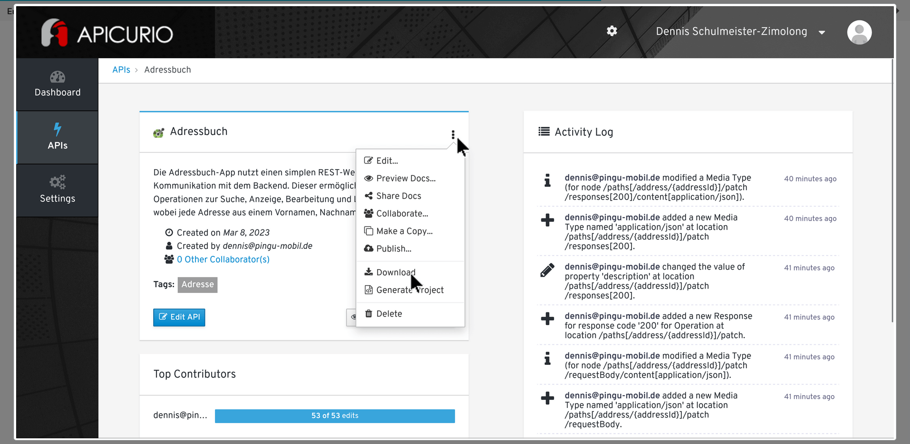

Modal Overlay Window
====================

Sometimes a large image (or any other large content) should be displayed as a thumbnail only,
overlaying the whole screen when clicked. This can be achieved with the `<lsx-modal-image>`
for images and `<lsx-modal>` custom elements for arbitrary HTML content:




```html
<lsx-modal-image src="image.png" caption="Thumbnail Caption"></lsx-modal-image>
```

Will be rendered as:

```html
<!-- Initially visible thumbnail -->
<div class="lsx-modal-thumbnail lsx-modal-image-thumbnail">
    
    Thumbnail Caption
</div>

<!-- Added to the HTML body, when the thumbnail is clicked -->
<!-- Will be closed by a mouse click -->
<div class="lsx-modal">
    
</div>
```

`<lsx-modal>` is a more generic version, when the thumbnail and the modal content can be
fully customized:

```html
<lsx-modal>
    <lsx-thumbnail>
        Thumbnail Content
    </lsx-thumbnail>
    <lsx-content>
        Modal Content
    </lsx-content>
</lsx-modal>
```

This will be rendered as:

```html
<!-- Initially visible thumbnail -->
<div>
    Thumbnail Content
</div>

<!-- Added to the HTML body, when the thumbnail is clicked -->
<!-- Will be closed by a mouse click -->
<div class="lsx-modal">
    Modal Content
</div>
```

All attributes of the `<lsx-thumbnail>` and `<lsx-content>` elements will be added ot their
respective `<div>` elements. This is especially useful to assign classes or style attributes
to the thumbnail.