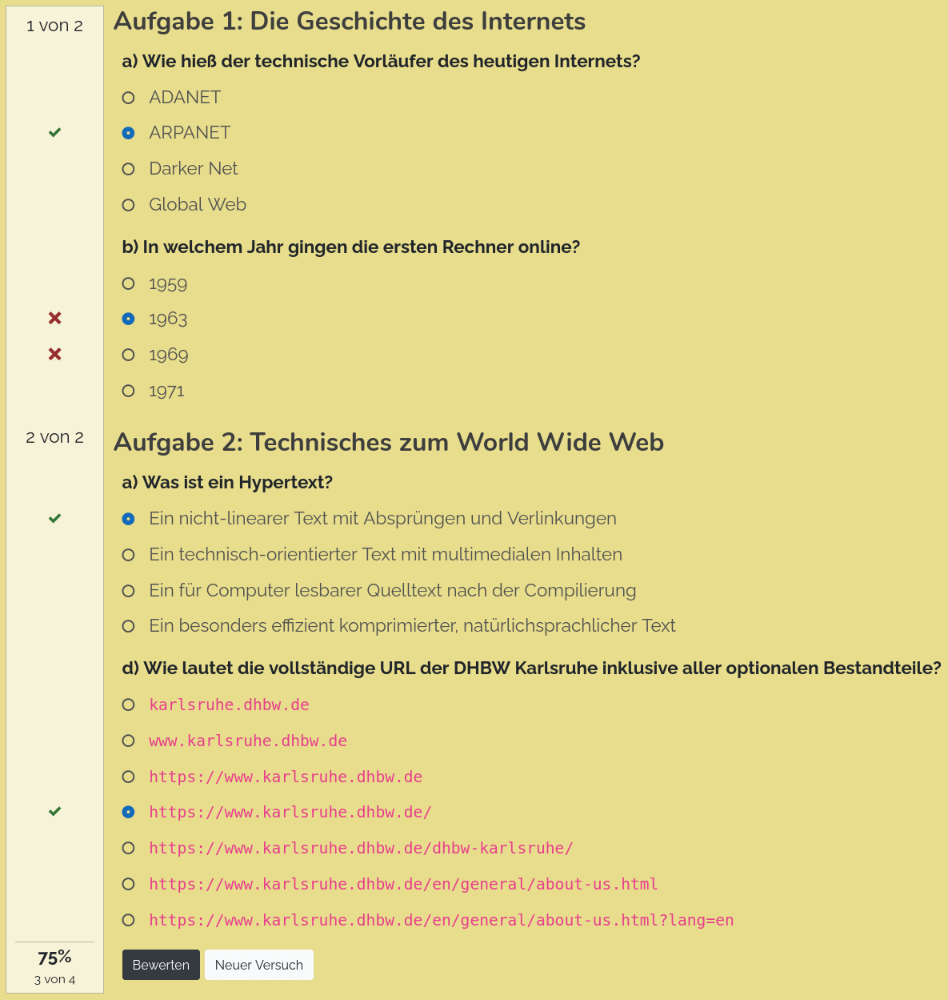

Interactive Quiz
================

1. [Description](#description)
1. [Getting Started](#getting-started)
1. [HTML Formatting](#html-formatting)
1. [Grading of the Answers](#grading-of-the-answers)
1. [Complex Validation Logic](#complex-validation-logic)


Description
-----------

This element allows to define interactive quizzes with types of answers and automatic validation.




Getting Started
---------------

A minimal example showcasing all answer types could be this:

```html
<lsx-quiz prefix="Exercise #:">
    <lsx-exercise title="History of the Internet">
        <!-- Single Choice Questions -->
        <lsx-question
            type = "single-choice"
            text = "a) What was the name of the Internet's precursor?"
            hint = "Try one of the acronyms."
        >
            <lsx-answer>ADANET</lsx-answer>
            <lsx-answer correct points="2">ARPANET</lsx-answer>
            <lsx-answer>Darker Net</lsx-answer>
            <lsx-answer>Global Web</lsx-answer>
        </lsx-question>

        <lsx-question
            type = "single-choice"
            text = "b) In which year the first computer went online?"
        >
            <lsx-question-hint>
                It was earlier than you might think.
            </lsx-question-hint>

            <lsx-answer>1959</lsx-answer>
            <lsx-answer>1963</lsx-answer>
            <lsx-answer correct>1969</lsx-answer>
            <lsx-answer>1971</lsx-answer>
        </lsx-question>
    </lsx-exercise>

    <lsx-exercise title="Technical Details on the Internet">
        <!-- Multiple-Choice Question -->
        <lsx-question
            type         = "multiple-choice"
            text         = "a) Which of the following can be part of a web address (URL)?"
            wrong-points = "-2"
            label-length = "8em"
        >
            <lsx-question-line>
                <lsx-answer correct>Protocol</lsx-answer>
                <lsx-answer points="-1">First name</lsx-answer>
                <lsx-answer points="-1">Last name</lsx-answer>
                <lsx-answer correct>Host name</lsx-answer>
            </lsx-question-line>
            <lsx-question-line>
                <lsx-answer>Postcode</lsx-answer>
                <lsx-answer correct>Port number</lsx-answer>
                <lsx-answer>House number</lsx-answer>
                <lsx-answer correct>Path</lsx-answer>
            </lsx-question-line>
            <lsx-question-line>
                <lsx-answer correct>Query parameters</lsx-answer>
                <lsx-answer>Geo coordinates</lsx-answer>
                <lsx-answer correct>Anchor</lsx-answer>
                <lsx-answer>Harbour</lsx-answer>
            </lsx-question-line>
        </lsx-question>

        <!-- Assignment Question (select positions can be "before", "after", "above", "below") -->
        <lsx-question
            type            = "assignment"
            text            = "b) Which web technology is used for the following purposes?"
            label-length    = "30em"
            select-position = "after"
            select-style    = "font-style: italic;"
        >
            <lsx-assignment answer="URL">To uniquely address resources at the world wide web:</lsx-assignment>
            <lsx-assignment answer="HTTP">To request data from a server and send it to the client:</lsx-assignment>
            <lsx-assignment answer="HTML">To define the structure and content of a web site:</lsx-assignment>
            <lsx-assignment answer="CSS">To define stylesheets for the visual appearance of a web site:</lsx-assignment>
            <lsx-assignment answer="JavaScript">To execute logic on the client e.g. for interactive behavior:</lsx-assignment>

            <!-- Dummy answers (can also be marked as wrong or partially-correct) -->
            <lsx-assignment answer="SVG" wrong></lsx-assignment>
            <lsx-assignment answer="PNG" wrong></lsx-assignment>
            <lsx-assignment answer="PDF" wrong></lsx-assignment>
            <lsx-assignment answer="SMTP" partially-correct></lsx-assignment>
            <lsx-assignment answer="FTP"  partially-correct></lsx-assignment>
        </lsx-question>

        <!-- Gap Text (line-start switches to source-code mode which preserves white-space) -->
        <lsx-question
            type = "gap-text"
            text = "c) Fill out the blanks in the following source code"
            mode = "source-code"
        >
            <!-- Length must be a CSS length -->
            <lsx-gap answer="<!DOCTYPE html>" ignore-case ignore-spaces></lsx-gap>
            &lt;<lsx-gap answer="html" ignore-case></lsx-gap>&gt;
                &lt;head&gt;
                   ...
                &lt;/head&gt;
                &lt;<lsx-gap answer="body" ignore-case></lsx-gap>&gt;
                   ...
                   <lsx-gap length="10em" regexp=".*" answer="<h1>Example</h1>"></lsx-gap>
                &lt;/body&gt;
                <!-- Using a <lsx-answer> to define partially correct answers -->
            &lt;<lsx-gap answer="/html" ignore-case ignore-spaces points="2"><lsx-answer partially-correct points="1">html</lsx-answer></lsx-gap>&gt;
        </lsx-question>
    </lsx-exercise>

    <lsx-exercise title="Fundamental Electronics">
        <!-- Assignment Question with multiple options side-by-side -->
        <lsx-question
            type            = "assignment"
            text            = "a) Which electrical components are shown on the following pictures?"
            select-length   = "20em"
            select-position = "below"
            select-style    = "font-style: italic;"
            empty-answer    = "<i>(no selection)</i>"
            empty-points    = "-1"
            wrong-points    = "-2"
        >
            <lsx-question-line>
                <lsx-assignment answer="Resistor"></lsx-assignment>
                <lsx-assignment answer="Capacitor"></lsx-assignment>
                <lsx-assignment answer="Coil"></lsx-assignment>
            </lsx-question-line>

            <lsx-question-line>
                <lsx-assignment answer="Switch"></lsx-assignment>
                <lsx-assignment answer="Potentiometer"></lsx-assignment>
                <lsx-assignment answer="Connector"></lsx-assignment>
            </lsx-question-line>
        </lsx-question>

        <!-- Gap text can also be used for simple text input. -->
        <!-- <lsx-question-line> can be optionally used to split the text into lines with their own correction marks. -->
        <lsx-question
            type         = "gap-text"
            text         = "b) According to Ohm's Law, which formulas convert between Voltage U, Resistance R and Current I?"
            mode         = "split-lines"
            empty-points = "-1"
            wrong-points = "-2"
        >
            U = <lsx-gap answer="R * I" ignore-case ignore-spaces></lsx-gap>
            R = <lsx-gap answer="U / I" ignore-case ignore-spaces></lsx-gap>
            I = <lsx-gap answer="U / R" ignore-case ignore-spaces></lsx-gap>
        </lsx-question>

        <!-- Same question with explicit <lsx-question-lines> -->
        <lsx-question
            type = "gap-text"
            text = "b) According to Ohm's Law, which formulas convert between Voltage U, Resistance R and Current I?"
        >
            <lsx-question-line>
                U = <lsx-gap answer="R * I" ignore-case ignore-spaces></lsx-gap>
            </lsx-question-line>
            <lsx-question-line>
                R = <lsx-gap answer="U / I" ignore-case ignore-spaces></lsx-gap>
            </lsx-question-line>
            <lsx-question-line>
                I = <lsx-gap answer="U / R" ignore-case ignore-spaces></lsx-gap>
            </lsx-question-line>
        </lsx-question>

        <!-- Free-Text Question (multi line) -->
        <lsx-question
            type = "free-text"
            text = "c) Why is the electrical current flowing through an electrical circuit proportional to the input voltage and the circuit's resistance?"
        >
            <!-- Editor can be "html" or "plain" -->
            <lsx-free-text
                initial      = "Your answer here"
                sample       = "While voltage describes ..."
                editor       = "html"
                validate     = "customValidationFunction"
                empty-points = "-1"
                wrong-points = "-2"
            >
                <!-- Alternative to the attributes -->
                <lsx-initial-answer>
                    Your answer here
                </lsx-initial-answer>

                <lsx-sample-answer>
                    <p>
                        While voltage describes the potential energy carried by the electrons (the higher the voltage, the more energy
                        the electrons transport), current describes the number of electrons flowing through the circuit in a time period
                        (though not quite correct, imagine it as the "speed of the electrons").
                    </p>
                    <p>
                        However the electrons cannot freely flow through the circuit but are hindered by the circuit element's individual
                        resistance. The higher the resistance, the more energy gets lost (actually gets transformed into heat) by the electrons
                        traveling through the circuit. As this reduces the energy that is making the electrons flow in the first place, this in
                        turn reduces the rate or "speed" of the resulting electron flow.
                    </p>
                </lsx-sample-answer>
            </lsx-free-text>
        </lsx-question>
    </lsx-exercise>
</lsx-quiz>
```

The nested structure where a `<lsx-quiz>` contains many `<lsx-exercise>`, which
contain many `<lsx-question>` and so on is important for this feature to work.


HTML Formatting
---------------

Question texts and hints can also be HTML formatted, either by including HTML tags
in the attributes or with explicit `<lsx-question-text>` and `<lsx-question-hint>`
(short form `<lsx-text>` resp. `<lsx-hint>`) elements.

```html
<lsx-question type="single-choice">
    <lsx-question-text>
        <b>HTML-formatted</b> question text.
    </lsx-question-text>

    <lsx-question-hint>
        The second answer is mostly right.
    </lsx-question-hint>

    <lsx-answer>Answer 1</lsx-answer>
    <lsx-answer>Answer 2</lsx-answer>
    …
</lsx-question>

<lsx-question type="multiple-choice">
    <lsx-text>...</lsx-text>
    <lsx-hint>...</lsx-hint>

    <lsx-answer>Answer 1</lsx-answer>
    <lsx-answer>Answer 2</lsx-answer>
    …
</lsx-question>
```


Grading of the Answers
----------------------

Answers can be marked correct, wrong and partially correct:

```html
<lsx-answer correct>
    Correct answer, gives 1 point if ticked.
</lsx-answer>

<lsx-answer partially-correct>
    Partially correct answer, gives 0.5 points if ticked.
</lsx-answer>

<lsx-answer wrong>
    Wrong answer, gives -1 point if ticked.
</lsx-answer>

<lsx-answer>
    Neutral answer, gives 0 points if ticked.
</lsx-answer>
```

The number of points can be overruled, if needed. But still each answer should be assigned
a correctness level.

```html
<lsx-answer correct points="5">Correct answer</lsx-answer>
<lsx-answer wrong points="-3">Wrong answer</lsx-answer>
...
```


Complex Validation Logic
------------------------

The elements `<lsx-gap>` and `<lsx-free-text>` offer the following options to validate the answers:

 * Verbatim expected answer:
    * Attribute `answer`: String with the expected answer
    * Attribute `ignore-case`: Ignore lower/upper case differences from the expected answer (by converting the answer to lower-case)
    * Attribute `ignore-spaces`: Ignore all whitespace differences from the expected answer (by removing all whitespace from the answer)

* Regular expression:
    * Attribute `length`: Width of the input field (e.g. `10em`)
    * Attribute `regexp`: Regular expression that must return a match
    * Attribute `answer`: Example answer shown as expected answer after validation
    
* Custom logic:
    * Attribute `length`: Width of the input field (e.g. `10em`)
    * Attribute `validate`: Name of a global Javascript function with the following signature:

      ```js
      /**
       * Custom validation function for free-text answers. Receives a parameter object with the following
       * keys. The implementing function can omit not-needed parameters from its declaration of the form
       * below is used.
       *
       *  `answer` contains the answer text to be validated.

       *  `evaluation` contains the properties `status`, `points` and `expected`, which must be changed.
       *    * `status` must be set to `status.unknown`, `status.correct`, `status.partial` or `status.wrong`.
       *      `status.unknown` means, that other validation methods should be tried (see remarks below)
       *    * `points` must be set to the credited points. Can be negative to deduce points.
       *    * `expected` should contain the expected correct answer, of the result is not `status.correct`.
       *
       * The remaining parameters contain the corresponding <lsx-...> DOM elements
       */
      function custom_validation({answer, evaluation, status, gapElement, questionElement, exerciseElement, quizElement}) {
          // Custom validation logic
      }
      ```

      At first the validation status will be `unknown` and the validation function will be executed, if defined.
      If it doesn't exist or the status remains `unknown`, the DOM event `lsx-quiz-validation` will be raised on
      the `<lsx-gap>`/`<lsx-free-text>` element. But note, that the event cannot bubble up to the parent HTML
      elements, since they are torn apart when the DOM structure is built. The event details (`event.detail`)
      contain the same attributes as the validation function would receive. If the result is still unchanged,
      the validation rules based on the other HTML attributes and nested `<lsx-answer>` elements are executed
      in the order they were defined. The first matching rule determines the result.