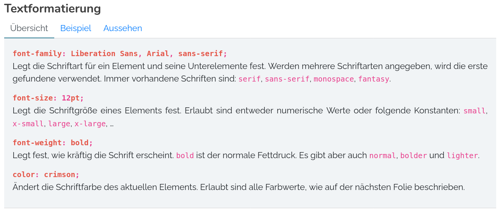

Tab Pages
=========

1. [Getting Started](#getting-started)
1. [Hidden and Disabled Tabs](#hidden-and-disabled-tabs)
1. [JavaScript API](#javascript-api)


Getting Started
---------------

Tab pages allow to switch between different content pages by clicking on a title.



```html
<lsx-tab-pages id="example">
    <lsx-tab-page title="Explanation">
        Content of the first tab page.
    </lsx-tab-page>
    <lsx-tab-page title="Case Study">
        Content of the second tab page.
    </lsx-tab-page>
    <lsx-tab-page title="Example Code">
        Content of the third tab page.
    </lsx-tab-page>
</lsx-tab-pages>
```

They will be rendered as plain bootstrap tab pages:

```html
<div>
    <ul class="nav nav-tabs" role="tablist">
        <li class="nav-item">
            <a
                id             = "example-page1-tab"
                class          = "nav-link active"
                data-bs-toggle = "tab"
                href           = "#example-page1"
                role           = "tab"
                aria-controls  = "example-page1"
                aria-expanded  = "true"
            >
                Explanation
            </a>
        </li>
        <li class="nav-item">
            <a
                id             = "example-page2-tab"
                class          = "nav-link"
                data-bs-toggle = "tab"
                href           = "#example-page2"
                role           = "tab"
                aria-controls  = "example-page2"
            >
                Case Study
            </a>
        </li>
    </ul>
    <div class="tab-content">
        <div
            class           = "tab-pane fade show active"
            id              = "example-page1"
            role            = "tabpanel"
            aria-labelledby = "example-page1-tab"
        >
            Content of the first tab page.
        </div>
        <div
            class           = "tab-pane fade"
            id              = "example-page2"
            role            = "tabpanel"
            aria-labelledby = "example-page2-tab"
        >
            Content of the second tab page.
        </div>
    </div>
</div>
```


Hidden and Disabled Tabs
------------------------

Single tab pages can be marked as hidden or disabled to prevent them from being opened. Hidden tabs
will be completely invisible, disabled tabs will remain visible but will be greyed out so that they
cannot be clicked. Together with the JavaScript API this allos to dynamically change the tab content.

```html
<lsx-tab-pages id="example">
    <lsx-tab-page title="Normal tab">
        This tab will be visible and enabled.
    </lsx-tab-page>

    <lsx-tab-page title="Invisible Tab" hidden>
        This tab will be completely invisible until re-enabled via the JavaScript API.
    </lsx-tab-page>

    <lsx-tab-page title="Disabled Tab" disabled>
        This tab will remain visible but cannot be clicked until re-enabled via the JavaScript API.
    </lsx-tab-page>
</lsx-tab-pages>
```


JavaScript API
--------------

If you set an explicit id for the `<lsx-tab-pages>` element, you can retrieve it later e.g. with
`document.getElementById()` and call one of the following methods to dynamically change the content:

### lsxSetVisibleTabs(visibleTabs, othersStillVisible)

Set which tabs are actually visible and which are invisible and cannot be used.
This is meant to dynamicly replace tabs by hidding some and showing some others.
The first tab has the number "1". The total number can be read from the property
`lsxNumberPages`.
 
* Parameter `visibleTabs` (`Array`): Visible tab numbers (strings or numbers)
* Parameter `othersStillVisible` (`boolean`): Leave other tabs visible but inactive

### lsxGotoTab(tabNumber)

Change the visible tab page.

### lsxEnableTab(tabNumber)

Reenable a previously disabled or hidden tab.

* Parameter `tabNumber` (`string|number`): Tab number

### lsxDisableTab(tabNumber, stillVisible)

Hide a tab or make it inactive so that it still remains visible but cannot be selected.

* Parameter `tabNumber` (`string|number`): Tab number
* Parameter `stillVisible` (`boolean`): Leave the tab selector visible but inactive

### lsxNumberPages

This property provides the total number of tab pages (similar to the `length` property of an Array).