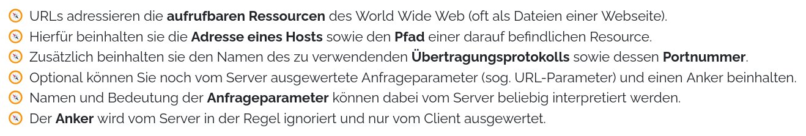

List with Emoji Symbols
=======================

Plain unordered lists sometimes look a bit boring. The custom element
`<lsx-ul>` thus allows to create lists with an emoji as a list symbol:



```html
<lsx-ul emoji="⚽">
    <li>List Item 1</li>
    <li>List Item 2</li>
    <li>List Item 3</li>
</lsx-ul>
```

Normally this will still be rendered as an html list:

```html
<ul style="list-style-type: '⚽  '";>
    <li>List Item 1</li>
    <li>List Item 2</li>
    <li>List Item 3</li>
</ul>
```

If however at least one of the list items contains its own emoji:

```html
<lsx-ul emoji="⚽">
    <li emoji="🎳">List Item 1</li>
    <li>List Item 2</li>
    <li>List Item 3</li>
</lsx-ul>
```

The list will be rendered as a table, instead:

```html
<table>
    <tr>
        <td style="padding-right: 0.5em;">🎳</td>
        <td>List Item 1</td>
    </tr>
    <tr>
        <td style="padding-right: 0.5em;">⚽</td>
        <td>List Item 2</td>
    </tr>
    <tr>
        <td style="padding-right: 0.5em;">⚽</td>
        <td>List Item 3</td>
    </tr>
</table>
```