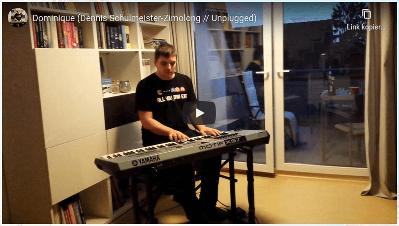

Youtube Video
=============

This element allows to embedded any youtube video, whose video ID (found in
the youtube URL) is known.



```html
<lsx-youtube video="HERMqverQWM" aspect-ratio="16by9"></lsx-youtube>
```

The video will be embedded with no cookies to protect the viewers identity.
It will be rendered as:

```html
<div class="embed-responsive ratio ratio-16x9">
    <iframe src="https://www.youtube-nocookie.com/embed/HERMqverQWM?rel=0&amp;showinfo=0" allowfullscreen></iframe>
</div>
```

The aspect ratio can be any ration supported by bootstrap:

 * `21x9`
 * `16x9` (default)
 * `4x3`
 * `1x1`
